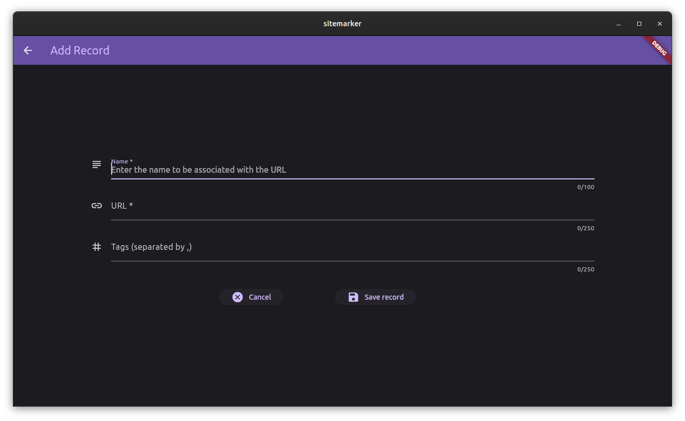

# Add a record

Adding a record to sitemarker is fairly simple.

#### Version 1.x:

- Click on **Add record** button
- Fill in the **Name**, **URL** and **Tags** fields. The **Name** and **URL** must be unique.
- Click on **Add record** button at the bottom to add and **Cancel** button at bottom to cancel.

#### Version 2.x:

- Click on the floating icon to proceed to the add page.

- Enter the record details in the form and press `Save record` button

## Rules for Name field

- Name field must be having unique entry. That is, no two records with same Name can exist.
- Name field must **not** be blank

Not following will end in error.

## Rules for URL field

- URL must be unique
- URL must have a protocol part (ie, http://, https://, ftp://, etc.)
- URL must be of valid format (ie, of the form https://example.com, https://example.com/somepath/, https://example.com/somefile.someextension, etc.)

Not following will end in error.

