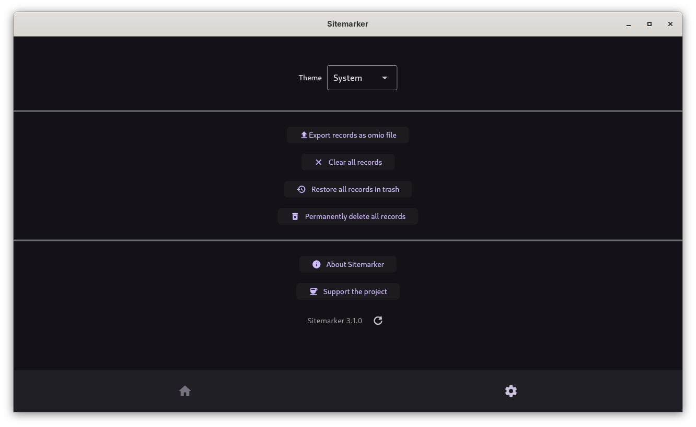

# Update To The Latest Version

Checking for updates is as simple as pressing a button!

- To check for newer version on desktop, first navigate to Settings tab:  

/// caption
Sitemarker Settings Page
///

- Now, click the refresh button next to the Version at the bottom:  

/// caption
Click the refresh button to check for updates
///

## Auto Updates

If you installed from any app stores ([See installation guide](./installation.md)), updates can be installed through them. On an application level, auto update notifications are NOT available as of version 3.1.0. It may be made available in a future version.