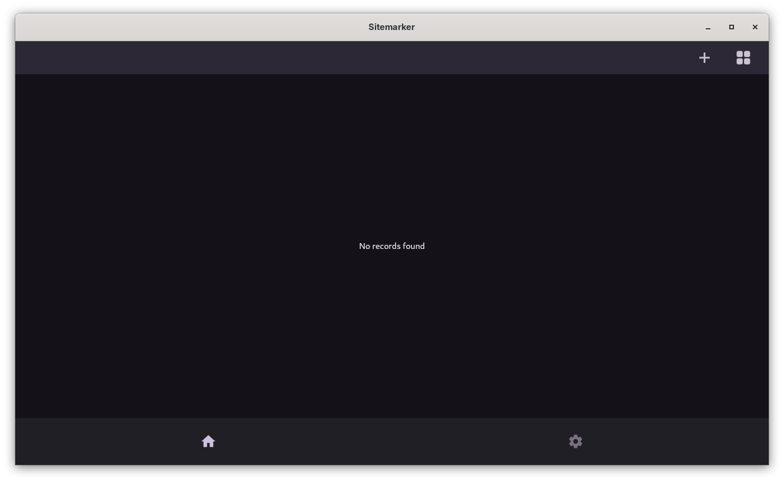
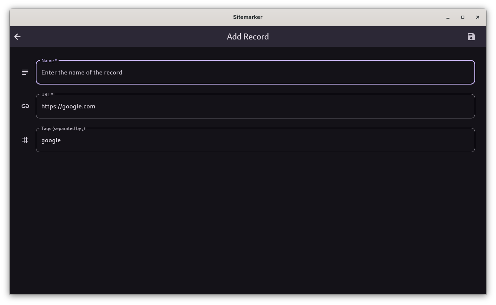

# Sitemarker Usage Docs

## View All Records

All records can be viewed on app launch. It is the application home page.

/// caption
View All Records
///

## Add A New Record

To add a new record, click the :material-plus: icon on the app bar followed by providing the necessary details in the page that follows. Then click the :material-content-save: button on appbar.

??? info "Android Users"
    Android users can share a link to Sitemarker application to autofill the URL. If you wait for a few seconds, Sitemarker will try to automatically get the website's title and fill in the Name field for you!

/// caption
Add A New Record
///

## Edit An Existing Record

To edit an existing record, click the :material-pencil: icon under the record you wish to edit. Then, perform all the required edits in the page that opens. Save the record by clicking :material-content-save: button on appbar.