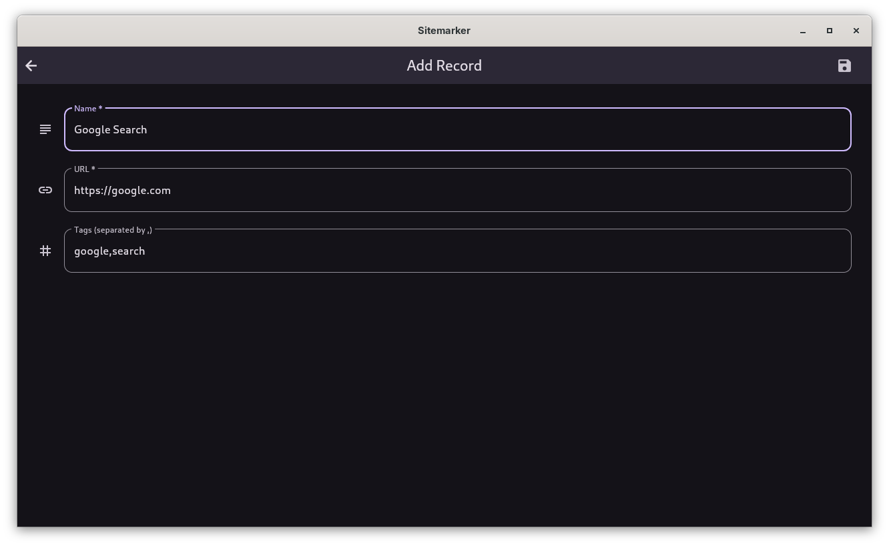

# Sitemarker Usage Docs

## View All Records

All records can be viewed on app launch. It is the application home page.

/// caption
View All Records
///

## Add A New Record

To add a new record, click the :material-plus: icon on the app bar followed by providing the necessary details in the page that follows. Then click the :material-content-save: button on appbar.

??? info "Android Users"
    Android users can share a link to Sitemarker application to autofill the URL. If you wait for a few seconds, Sitemarker will try to automatically get the website's title and fill in the Name field for you!

/// caption
Add A New Record
///

/// caption
Result
///

## Edit An Existing Record

To edit an existing record, click the :material-pencil: icon under the record you wish to edit. Then, perform all the required edits in the page that opens. Save the record by clicking :material-content-save: button on appbar.

/// caption
Edit a record
///

/// caption
Result
///

## Delete An Existing Record

To soft delete a record, click the :material-delete: icon under the desired record. A toast indicating deletion will show up and the record will be soft deleted. All soft deleted records can be restored at once. To view the deleted records, click or tap the :material-delete: icon on the app bar.

??? failure "Records with name or URL after soft deleted records"
    Records with name or URL after soft deleted records **WILL** result in error. This is not true for those records deleted from trash.

To delete a record from trash as well (delete permanently), visit the deleted record on the recycle bin, tap/click the :material-delete: icon beneath the record to be permanently deleted. To delete all records in trash permanently, visit Settings and tap/click the `Permanently delete all records` button. There is also a button to restore all soft-deleted records as well.

??? warning "Permanent Deletion"
    Deletion through `Permanently delete all records` button AND through the recycle bin ARE permanent. Records deleted in such a way **cannot** be restored.

## Importing a record

To import a `.omio` file (Sitemarker export file format), visit the Import/View page by clicking/tapping :material-view-grid: on app bar and clicking/tapping `Import from Omio File` button. Import will be done and duplicate records listed.

??? note "Duplicate records"
    Duplicate records will not be imported.

## Viewing content of .omio file

To view a `.omio` file (Sitemarker export file format), visit the Import/View page by clicking/tapping :material-view-grid: on app bar and clicking/tapping `View Omio File` button.

## Export all records

To export all records, go to Settings, tap/click `Export records as omio file`. On Android, the files will be exported to Downloads directory. On desktop platforms, a file location selection dialog will pop up which decides where the file is exported to.