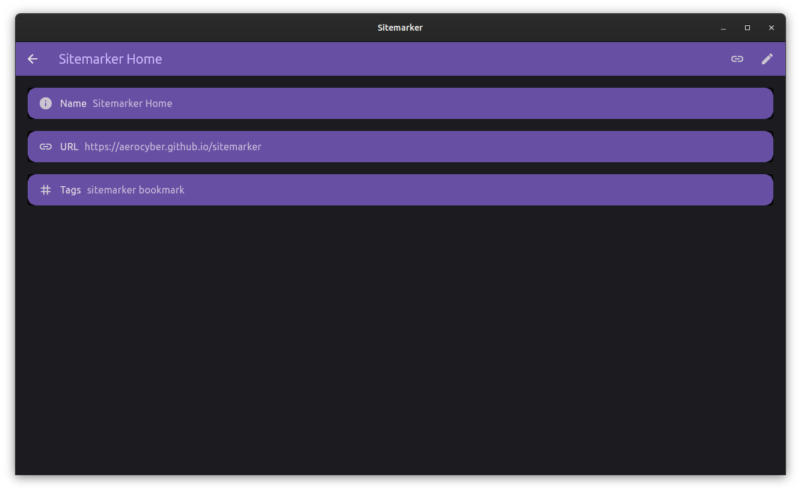
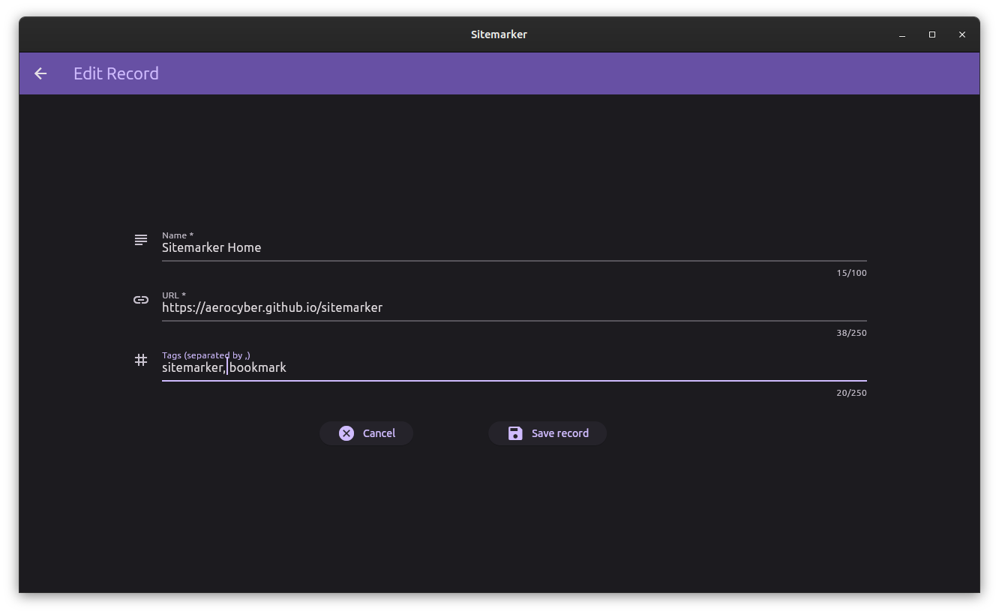

# Viewing and Editing records

## Version 1.x

In version 1.x, viewing and editing are not connected. You'll have to click the View records in database to view the records.
To edit, you have no option.

## Version 2.x

The default view of the rewritten version is the view mode. 

You can view details of each record by clicking them:

The link button opens the link in default browser. The edit button opens the edit screen:

### Known issue

It is known that the edit and view screens do not respect tag separations. This **_will_** be addressed in version 2.0.1.